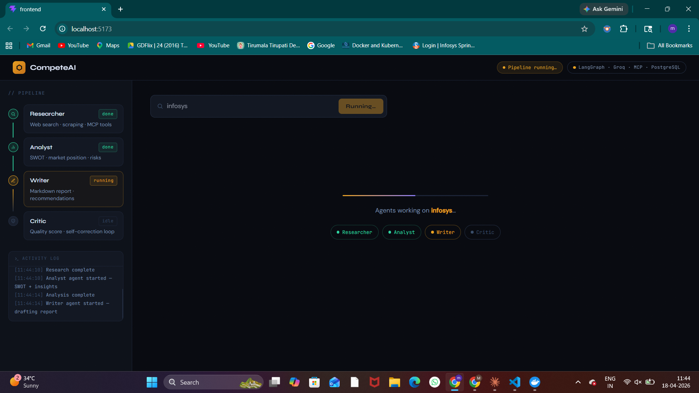
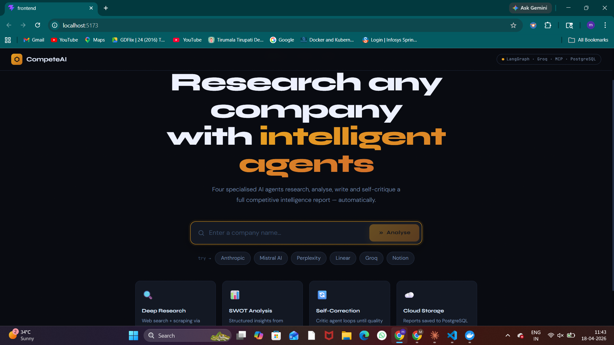
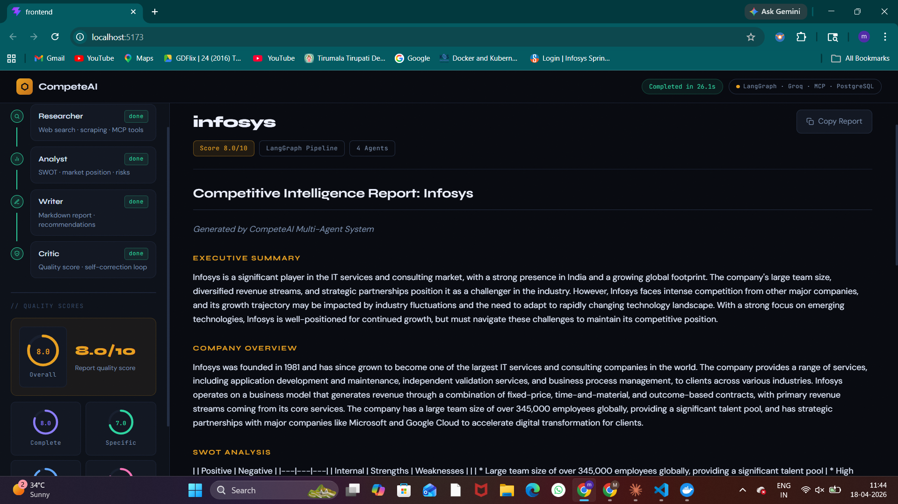

# CompeteAI — Multi-Agent Competitive Intelligence System

> Give it a company name. Four AI agents research, analyse, write and self-critique a full intelligence report — automatically.



## Demo





## How it works
## Tech Stack

| Layer | Technology |
|---|---|
| Agent Orchestration | LangGraph |
| Agent Framework | LangChain |
| LLM | Groq — llama-3.3-70b-versatile (free) |
| Tool Server | Custom MCP Server (Anthropic protocol) |
| Web Search | DuckDuckGo (free, no API key) |
| Backend | FastAPI with Server-Sent Events |
| Database | PostgreSQL 16 in Docker |
| Frontend | React + Vite + Bootstrap 5 |

## Getting Started

### Prerequisites
- Python 3.10+
- Node.js 18+
- Docker Desktop

### 1. Clone the repo

```bash
git clone https://github.com/YOURUSERNAME/competeai.git
cd competeai
```

### 2. Set up Python

```bash
python -m venv venv
source venv/Scripts/activate
pip install -r requirements.txt
```

### 3. Add your API key

```bash
cp .env.example .env
```

Open `.env` and add your Groq API key. Get one free at [console.groq.com](https://console.groq.com) — no credit card needed.

### 4. Start the database

```bash
docker-compose up -d
```

### 5. Start the backend

```bash
uvicorn app:app --reload --port 8000
```

### 6. Start the frontend

```bash
cd frontend
npm install
npm run dev
```

### 7. Open the app

Go to `http://localhost:5173`

## Project Structure
## Key Patterns

**Self-correcting loop** — The Critic agent scores the report out of 10. If the score is below 7, LangGraph routes back to the Writer with the critic feedback injected. This repeats up to two times automatically.

**Custom MCP Server** — Built using Anthropic's Model Context Protocol. The server advertises three tools (web search, page scraping, sentiment analysis) that any MCP-compatible client can discover and call.

**Real-time streaming** — FastAPI streams Server-Sent Events to the React frontend as each agent completes. No polling — the UI updates instantly.

## License

MIT — see [LICENSE](LICENSE)

## Author

Built by Makki as a portfolio project demonstrating multi-agent AI systems.
